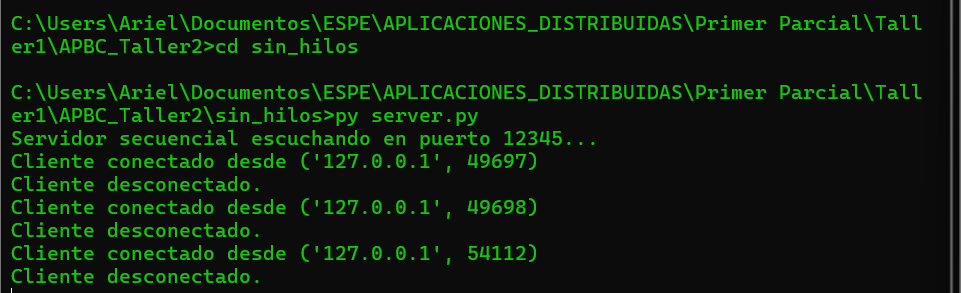
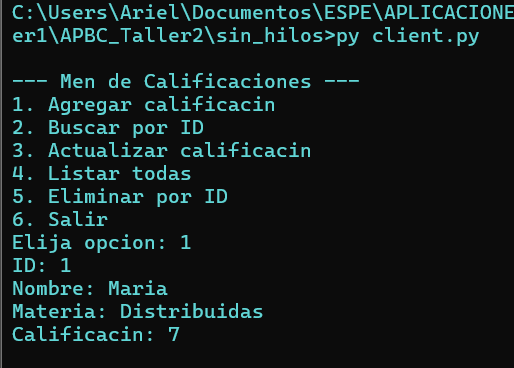
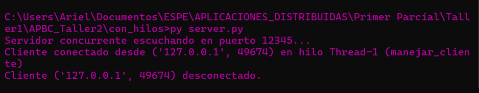
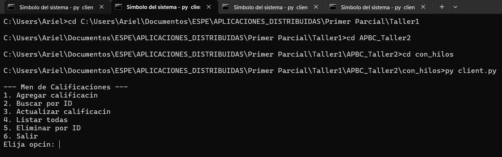
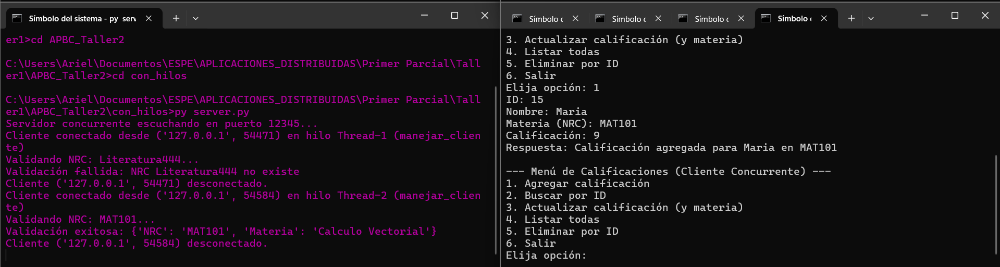
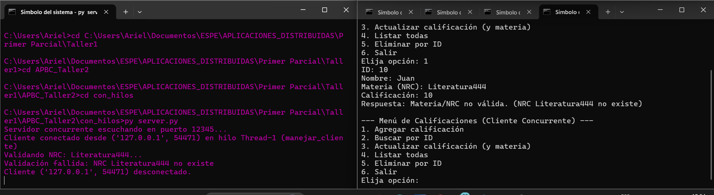

# Laboratorio 2: Sistema Distribuido de Registro de Calificaciones

**Universidad de las Fuerzas Armadas ESPE**

**Carrera de Ingeniería de Software**

**Aplicaciones Distribuidas**


**Integrantes**

Ariel Reyes

Ariel Guevara

## 1. Descripción General del Proyecto

Este proyecto implementa una aplicación distribuida cliente-servidor para el registro de calificaciones finales de estudiantes. El sistema utiliza sockets TCP para la comunicación y un archivo CSV como repositorio de datos simple y persistente.

El proyecto evoluciona desde un servidor secuencial (monolítico) a un servidor concurrente (escalable) usando hilos, e introduce la comunicación inter-servidores para la validación de datos, simulando una arquitectura de microservicios.

### Componentes

* **Servidor de Calificaciones (`server.py`):**
    * [cite_start]Gestiona el archivo `calificaciones.csv`[cite: 14].
    * [cite_start]Escucha en el puerto `12345`[cite: 15].
    * [cite_start]Procesa comandos CRUD (Agregar, Buscar, Actualizar, Listar, Eliminar) [cite: 17-21].
    * [cite_start]Responde a los clientes con mensajes JSON (ej. `{"status": "ok", "data": [...]}`)[cite: 15].
    * [cite_start]Existe en dos versiones: `sin_hilos/` (secuencial) y `con_hilos/` (concurrente)[cite: 36, 39].

* **Cliente (`client.py`):**
    * [cite_start]Provee un menú interactivo en la consola para que el usuario seleccione las operaciones[cite: 16].
    * [cite_start]Envía los comandos al servidor y muestra las respuestas JSON formateadas[cite: 172].

* **Servidor de NRCs (`nrcs_server.py`):**
    * [cite_start]Un servidor dedicado y simple que actúa como un servicio externo de validación[cite: 300].
    * [cite_start]Gestiona `nrcs.csv` (con columnas `NRC`, `Materia`)[cite: 302].
    * [cite_start]Escucha en el puerto `12346`[cite: 303].
    * [cite_start]El Servidor de Calificaciones lo consulta antes de `AGREGAR` o `ACTUALIZAR` un registro para verificar que la materia (NRC) sea válida[cite: 303, 311].

## 2. Estructura de Directorios
    laboratorio_2/ 
    ├── README.md 
    ├── calificaciones.csv 
    ├── nrcs.csv 
    ├── nrcs_server.py 
    ├── sin_hilos/ │ 
        ├── server.py │ 
        └── client.py 
    └── con_hilos/ 
        ├── server.py 
        └── client.py

[cite_start]*(Estructura basada en [cite: 33-41] [cite_start]y los añadidos de la Parte 2 [cite: 306])*

## 3. Instalación y Ejecución

### Dependencias

[cite_start]El proyecto utiliza únicamente bibliotecas estándar de Python (socket, csv, json, os, threading) [cite: 44-47, 251]. No se requieren dependencias externas.

### Parte 1: Prueba Secuencial (sin_hilos)

1.  **Levantar el Servidor:**
    ```bash
    cd sin_hilos
    py server.py
    ```
    

2.  **Ejecutar el Cliente:** (En una nueva terminal)
    ```bash
    cd sin_hilos
    py client.py
    ```
    

### Parte 2: Prueba Concurrente con Validación NRC (con_hilos)

[cite_start]Para esta prueba, necesitará al menos tres terminales [cite: 317-321].

1.  **Terminal 1: Levantar el Servidor de NRCs:**
    *(Desde el directorio raíz `laboratorio_2/`)*
    ```bash
    python nrcs_server.py
    ```

2.  **Terminal 2: Levantar el Servidor de Calificaciones Concurrente:**
    ```bash
    cd con_hilos
    python server.py
    ```
    [cite_start]*(Verá el mensaje: `Servidor concurrente escuchando en puerto 12345...` [cite: 288])*
    
    
3.  **Terminal 3 (y 4, 5...): Levantar Clientes:**
    ```bash
    cd con_hilos
    python client.py
    ```
    
## 4. Ejemplos de Uso

Una vez que los servidores de la Parte 2 estén corriendo, puede probar los siguientes casos:

### Caso de Prueba 1: Agregar con NRC Válido

1.  En el Cliente (Terminal 3), elija la opción `1. Agregar calificación`.
2.  Ingrese los datos. Cuando pida `Materia`, use un NRC que exista en `nrcs.csv` (ej. `MAT101`).
3.  **Resultado Esperado:** El servidor de calificaciones consultará al servidor NRC, recibirá una respuesta válida y guardará la calificación. [cite_start]El cliente mostrará un mensaje de éxito[cite: 323].

### Caso de Prueba 2: Agregar con NRC Inválido

1.  En el Cliente, elija la opción `1. Agregar calificación`.
2.  Ingrese los datos. Cuando pida `Materia`, use un NRC que no exista (ej. `ABC123`).
3.  **Resultado Esperado:** El servidor de calificaciones consultará al servidor NRC, recibirá una respuesta de error (no encontrado) y rechazará el registro. [cite_start]El cliente mostrará un mensaje de error como "Materia/NRC no válida" o "NRC no existe"[cite: 312, 324].

## 5. Notas sobre Concurrencia y Limitaciones

### Cómo Probar la Concurrencia

* [cite_start]Para verificar la escalabilidad, ejecute la Parte 2 y abra múltiples clientes (Terminal 3, Terminal 4, etc.)[cite: 321].
* [cite_start]Intente agregar calificaciones (una válida y una inválida) desde dos clientes diferentes al mismo tiempo[cite: 325].
* [cite_start]Observe el log de la Terminal 2 (Servidor de Calificaciones): verá mensajes que indican que los clientes fueron manejados en hilos separados (ej. `Cliente conectado desde ... en hilo Thread-X`)[cite: 274].

### Simulando Fallos

* **Fallo del Servicio NRC:** Con el sistema de la Parte 2 corriendo, detenga el `nrcs_server.py` (Terminal 1).
* Intente agregar cualquier calificación desde un cliente.
* [cite_start]**Resultado Esperado:** El Servidor de Calificaciones intentará conectarse al puerto 12346, fallará (capturará la excepción de conexión [cite: 315][cite_start]) y retornará un error al cliente, como "Error consultando NRC"[cite: 327].

### Limitaciones

* **Condiciones de Carrera (Race Conditions):** La implementación concurrente (`con_hilos/server.py`) accede directamente al archivo `calificaciones.csv` desde múltiples hilos sin usar mecanismos de bloqueo (como `threading.Lock`). Si dos hilos intentan *escribir* (actualizar o eliminar) en el archivo CSV exactamente al mismo tiempo, podría llevar a corrupción de datos o pérdida de actualizaciones.
* **Gestión de Errores:** El servidor no maneja explícitamente IDs duplicados al agregar; simplemente los añade.
